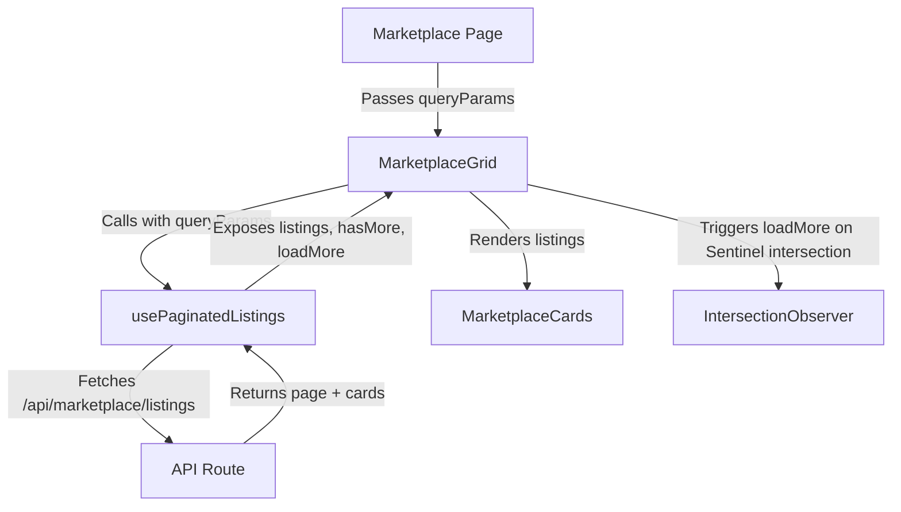

# Marketplace Pagination Documentation

This document describes the design and implementation of cursor-based pagination (Load More button and Infinite Scroll) for the marketplace listings grid.

## Architectural Overview

The marketplace pagination architecture utilizes a custom React hook to manage data fetching, state transitions, query parameter synchronization, and duplicate detection, while the marketplace grid component handles the presentation and the intersection observer sentinel for infinite scroll.

## 1. Custom Hook: `usePaginatedListings`
- **Location:** `src/hooks/usePaginatedListings.ts`
- **Responsibilities:**
  - Manages lists, loading state, next page cursor, and whether more pages exist.
  - Automatically resets pagination and clears listings synchronously during render when query parameters (sorting, filters) change.
  - Dedupes results by ID to prevent duplicate items from appearing if the database shifts.
  - Provides a `disabled` flag to prevent background fetching when pre-loaded items are supplied (e.g. during testing or static mocks).
  - Standardizes error handling and cleans up in-flight requests on fast parameter updates.

## 2. Component: `MarketplaceGrid`
- **Location:** `src/components/MarketplaceGrid.tsx`
- **Responsibilities:**
  - Consumes `usePaginatedListings` hook to load items.
  - Utilizes an `IntersectionObserver` sentinel div placed at the bottom of the grid to trigger infinite-scroll loading.
  - Provides a manual "Load more" button for accessibility when keyboard users are browsing.
  - Renders inline loading indicator states and gracefully handles empty/end-of-list scenarios.

## 3. Integration: `Marketplace` Page
- **Location:** `src/app/marketplace/page.tsx`
- **Responsibilities:**
  - Renders `MarketplaceGrid` by forwarding the filters and sorting options inside a reactive `queryParams` object.
  - Synchronizes filter resets immediately, enabling seamless switching between filters and infinite scrolling.

## Verification
- Unit tests are located at `src/hooks/__tests__/usePaginatedListings.test.ts`.
- The tests verify:
  1. The hook fetches the first page of listings and appends subsequent pages upon `loadMore()` triggers.
  2. The hook terminates and sets `hasMore: false` once a page returning fewer items than the page size is received.
